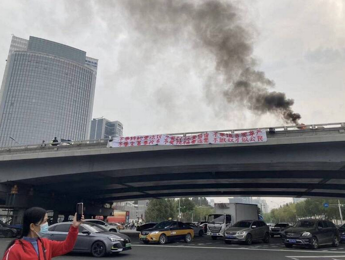
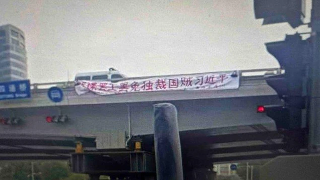

# a4muc

This README file is written in **Chinese (simplified) 简体中文**. For other languages, please click the following links:

<a href="https://github.com/2f183a4e64493af3f377f745eda50236/a4muc/blob/main/README.md">简体中文</a>	<a href="https://github.com/2f183a4e64493af3f377f745eda50236/a4muc/blob/main/README_OTHER_LANGUAGES/README_zh_TW.md">繁體中文</a>	<a href="https://github.com/2f183a4e64493af3f377f745eda50236/a4muc/blob/main/README_OTHER_LANGUAGES/README_en_US.md">English</a>	<a href="https://github.com/2f183a4e64493af3f377f745eda50236/a4muc/blob/main/README_OTHER_LANGUAGES/README_de_DE.md">Deutsch</a>

## Events

See <a href="https://github.com/2f183a4e64493af3f377f745eda50236/a4muc/blob/main/events.md">events.md</a> (English only)

## 什么是白纸革命？

### 背景

中共一直实行独裁专制。尤其是在习近平上台之后，中共的独裁更是上了一个新的台阶。习近平上台后实行个人崇拜，更是在2018年修改宪法废除“国家主席、副主席连续任职不得超过两届”的规定，谋求长期执政。此外还将所谓的“习近平新时代中国特色社会主义思想”写入宪法序言。自己把自己写入宪法，这是多么荒谬的事情！习近平的治国无方，以及对个人独裁的追求，正在将越来越多的中国人从“中国梦”中敲醒。

### 导火索

#### 四通桥抗议

习近平在修改宪法之后，正如大家的预期，他在2022年10月召开的中共二十大谋求连任第三届国家主席。在2022年10月13日，一名抗议者在北京四通桥悬挂两条横幅，上面分别写着“不要核酸要吃饭 不要封控要自由 不要谎言要尊严 不要文革要改革 不要领袖要选票 不做奴才做公民”和“罢课罢工罢免独裁国贼习近平”。与此同时，他还用扩音设备播放口号“要吃饭，要自由，要选票！罢课，罢工，罢免独裁国贼习近平！”，并点燃轮胎，用燃起的浓烟吸引注意力。这些口号，无论是要求解封还是要选票，甚至要求总统下台，在许多民主国家，都是再正常不过的诉求。可是在中国，尤其是“习近平新时代”，不好意思，他会被任意逮捕，并且失踪至今。人们不知道他的任何消息。

<table>
  <tr>
    <td width="50%"></img></td><td></img></td>
  </tr>
	<tr>
    <td colspan="2" align="center">四通桥横幅</td>
	</tr>
</table>

#### 反封控示威

#### 乌鲁木齐火灾

### 为什么举白纸？

### 我们仅仅在抗议封控吗？

## 我们有什么诉求？

## 我可以做什么？

## 目录

## 友情链接

## 欢迎投稿

现长期征集以下主题的素材：

1. 目录中已经存在的主题
2. 对已存在内容的补充、更正

3. 习近平、中共

- 习近平如何推行个人崇拜
- 典型的粉红网民言论及对应驳斥
- 中共官媒、赵立坚、华春莹、胡锡进、张维为等喉舌的言论
- 中共的疫情防控措施
- 中共如何限制言论自由和大规模监控
- 中共打压女权、性少数群体
- 中共打压维吾尔人、藏人、港人等
- 中共对台湾的打压
- 中共煽动对其他国家的仇恨，比如美国、日本、乌克兰、印度等
- 中共帮助其他独裁政体，比如俄罗斯等
- 中共如何破坏其他国家的民主，比如海外警务站等
- 海内外中国人抗争面临的困境
- 其他主题。中共实在是罄竹难书，罪行远远不止以上的主题。欢迎大家建议增加更多主题。
- 以上各主题的外文翻译

4. 关于其他国家的人抗争他们国家的独裁政府的故事，比如伊朗等。

投稿请发送电子邮件至 a4muc (at) proton (.) me
