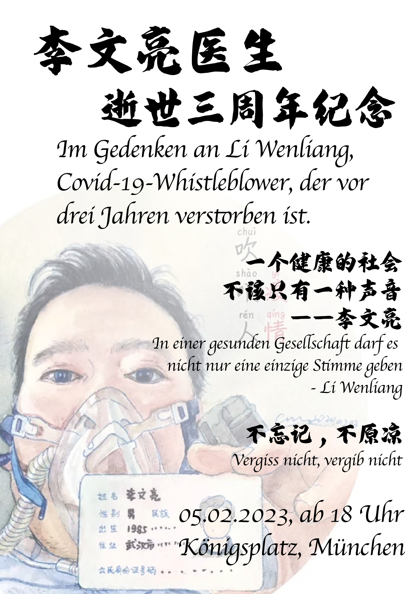
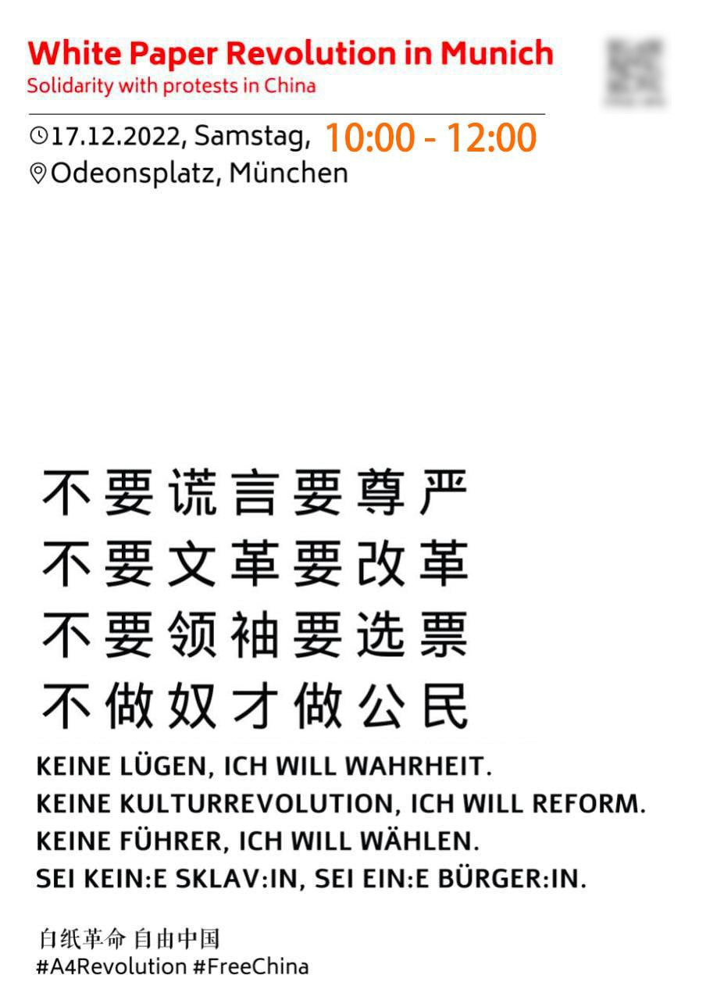
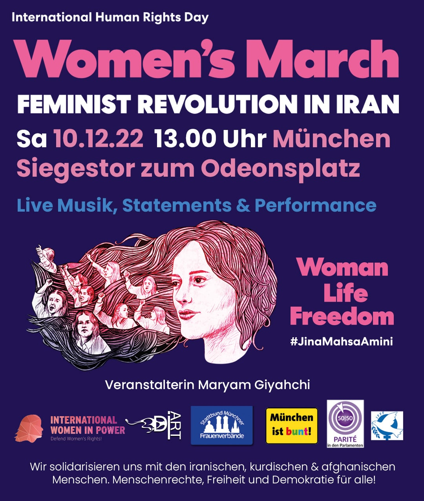

# Events

Last update: 05.02.2023 CET

For security reasons, group links and QR codes will <b>NOT</b> be published here.

## Upcoming

(Description in Chinese language only)

“李医生，三年了。这个世界没有变好，但有良知的人还是没有放弃努力让它变得更好一点。希望您在天上能心安。”

三年了，中国官方一直想尽一切办法让人们忘却。我们拒绝喝下每次清零之后庆功的酒，我们拒绝用那些虚假的歌颂淡化人们对每个不幸的记忆，我们拒绝沉默。我们不会忘记，也不会原谅这一切罪行。因为我们知道，如果我们不断忘记这一切，发生在李文亮身上的悲剧一定会不断重演：这三年里，许多人因为不科学的防疫政策离开人世，许多朋友没能回家见亲人的最后一面，还有许多人因言获罪甚至失联至今。

我们要求中国政府：

1. 释放被捕人士

2. 允许公开悼念

3. 尊重言论自由

2023年2月5日下午18:00，让我们一起在慕尼黑Königsplatz点燃纪念李文亮医生和其他逝者的蜡烛，分享关于疫情的故事，表达我们共同的诉求。

欢迎大家带上鲜花、蜡烛（推荐电子蜡烛），还有自制海报。我们不见不散。

## Past

<table>
  <tr>
    <th>Poster</th><th>Comment</th>
  </tr>
  <tr>
    <td width="50%"></td><td>
China has ended the Zero-COVID-Policy. However, this is not the end of our white paper revolution. These tragedies happened because there is no freedom of speech in China under the rule of the CCP. The CCP does not accept criticism and does not follow science when making policies. We will continue to protest against Xi Jinping and the CCP.

中国结束了清零政策。然而我们的白纸革命没有结束。这些悲剧的发生都是因为中共统治下的中国没有言论自由。中共不接受批评，制定政策时不遵循科学。我们将继续对习近平、中共进行抗争。
</td>
  </tr>
	<tr>
    <td width="50%"></td><td>
We stand with Iranians and we were invited to give a speech, talking about women's rights in China.

我们声援伊朗人，并发表了关于中国女性权利状况的演讲。
</td>
  </tr>
	<tr>
    <td width="50%">27.11.2022, Sankt-Jacobs-Platz</td><td>
An impromptu meeting, memorial to those who died in Urumqi fire.

我们自发悼念乌鲁木齐大火中逝去的人们。
</td>
  </tr>
</table>

